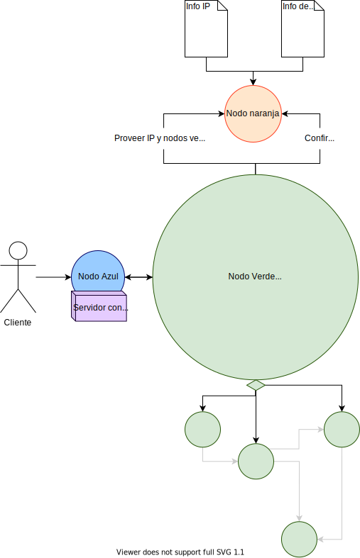
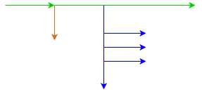

# Nombre del Equipo: Team Computin

#  Integrantes :

* Edwin Josué Brenes Cambronero
* Mario Alberto Víquez González
* Alejandro Abarca Soto
* Felipe Vega Vindas

# Análisis del Proyecto Integrador de Redes y Sistemas Operativos

# Descripción General:

El objetivo es armar una red overlay o lo que se conoce como una red virtual de nodos, los cuales se
encuentran lógicamente enlazados y se mantiene funcional sobre otra red. En esta red, los nodos van
a estar conectados por una topología arbitraria, es decir, los nodos de red se interconectan por
algún medio de comunicación. El protocolo de comunicación que se debe usar entre cada nodo y sus vecinos, es el protocolo llamado UDP.

# Fase 1:
Vamos a trabajar con diferentes tipos de nodos durante el desarrollo del proyecto a los cuales se les ha asignado
un color para entender mejor esta primera fase y son los siguientes: 
- **Verde:**  Es el nodo principal, y debido a que existirá un conjunto de nodos de este tipo, entonces cada nodo verde se comunicará con un homológo al cual se encuentra conectado (son vecinos). Escrito en lenguaje C
- **Naranja:** Es el nodo interprete, se encarga de establecer la topología de la red y pasarle la información al nodo verde, esto lo hace mediante la lectura de archivos desde el directorio, en donde obtiene la identificación y la lista de vecinos cercanos. Escrito en lenguaje Python
- **Azul:** Nodo que contiene la interfaz con el usuario, se encarga de enviar mensajes a través de los nodos verdes. Existe un intermediario entre el nodo azul y el nodo verde, un servidor con protocolo HTTP.

Como objetivo principal de esta fase de Proyecto se pretende que se lea la topología de la red, y así mismo, que se maneje el envío de mensajes sencillos de máximo 200 caracteres, estos se enviarán entre un nodo verde y los nodos cercanos más próximos.

Como mencionamos anteriormente, el tipo de nodo más importante es el que denominamos como verde, este va a ser el principal y el que arma toda la red en general, sin embargo, este nodo tiene la particularidad de que es necesario indicarle la ubicación que este debe de tener en la red y el nombre, ya que en un inicio, no posee esa información. Un objetivo importante de esta fase es precisamente aprender a como pasarle esta información, esto se hace mediante la creación de otro nodo al cual denominamos naranja, y va a ser el encargado de establecer la topología de la red, esto se hace mediante un pipe (cadena de procesos conectados donde la salida de cada elemento de la cadena es la entrada del próximo) de entrada y de salida con el proceso original.

Existen otros nodos los cuales los denominamos azules, estos van a poder enviar mensajes a través de los nodos verdes, precisamente, la recepción y creación de mensajes está a cargo del nodo azul, el cual está conectado a una interfaz web con la cual puede interactuar con el usuario, el usuario será quien indique el mensaje, origen y destino. La interfaz está construida por medio de un “cliente web” y existe un intermediario entre el nodo azul y el nodo verde, que es un servidor con un protocolo HTTP. 

Se establece que la comunicación normal del nodo verde con los vecinos es a través de un protocolo que se denomina User Datagram Protocol o UDP, el cual, permite el envío de datagramas sin establecer una conexión previa.

# Ilustración del Proyecto

# Línea de tiempo

A continuación, se muestra una línea de tiempo de lo que se va a ocurrir en la primera fase del proyecto:

La línea verde muestra la ejecución completa de un nodo verde, la línea naranja representa el momento
en el cual se crea el fork y las líneas azules representan la creación de hilos para establecer la comunicación.

# Dudas

1. ¿Cuál es el producto final o lo que se pretende entregar de cara al proyecto?
2. ¿Dónde va el servidor HTTP (por ejemplo, adentro a al lado del nodo azul), es aparte del cliente?
4. Como hace un nodo naranja para saber cual es su nodo verde "asignado"?
1. ¿Qué es un cliente y qué es un servidor, cuáles son las diferencias?
1. ¿Qué son los pipes y cómo se implementan?
1. ¿Cuál es la función de los identificadores, cuál es la diferencia entre IP e identificador en función?
1. ¿Cuál es la manera de direccionar los mensajes?
1. ¿Qué es un socket?
1. ¿Cuál es la diferencia entre comunicación por pipes y sockets o websockets?
1. ¿A nivel físico o de software qué son los nodos y cómo se implementan?
1. Existen componentes que debe tener cada nodo, ¿cómo se le agregan estos componentes?
1. Cuál es el formato que debe darle el nodo naranja a los vecinos y cómo lo hace?
1. ¿Cómo se da la comunicación entre un nodo y el host?
2. ¿Las conexiones entre los nodos existen antes de la creación de los nodos verdes, o son estos últimos los que la simulan?
